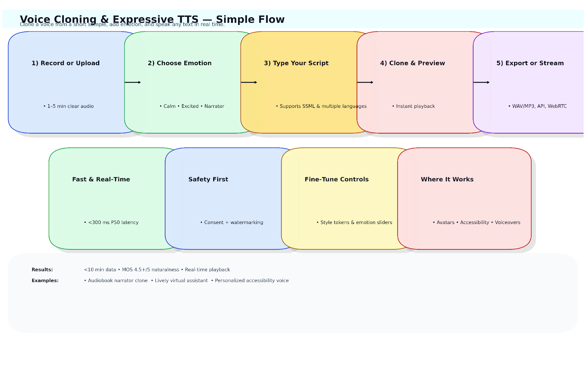
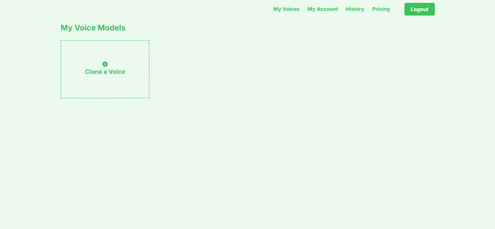
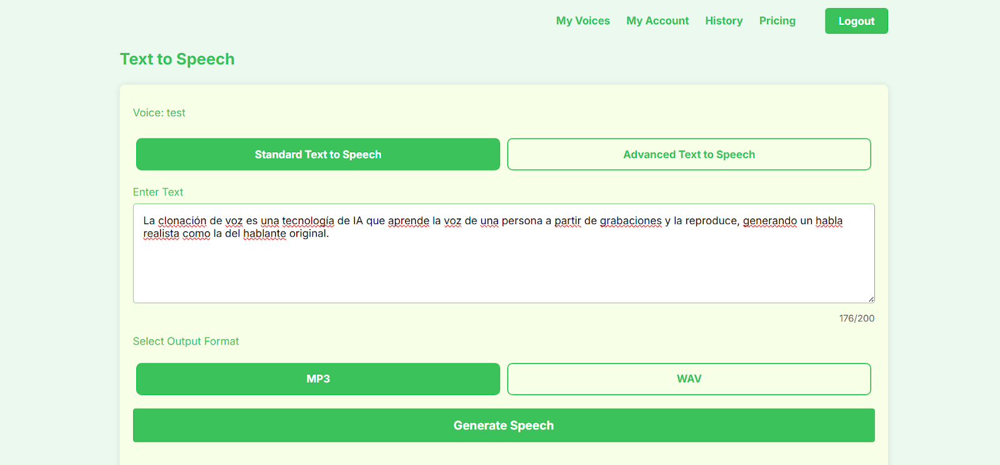
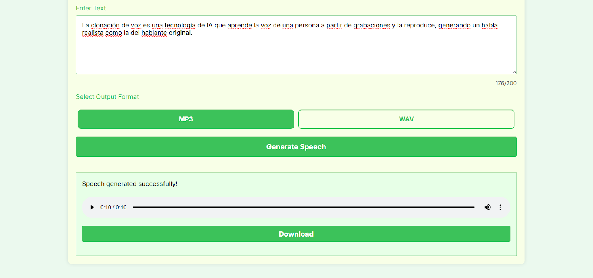
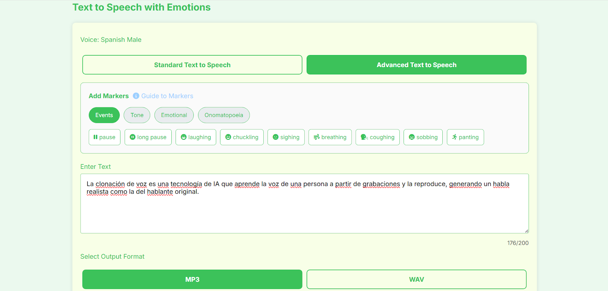

# Voice Cloning & Expressive TTS Application

## Introduction
Voice Cloning & Expressive TTS Application is a system that creates natural, human-like speech from just a few minutes of audio. Unlike standard text-to-speech, it can clone unique voices and add emotional nuance—changing tone, rhythm, and intensity for more expressive results. Built on advanced deep learning (E5 TTS), it enables real-time, high-quality voice generation for avatars, audiobooks, accessibility tools, and voice-driven applications. This makes digital voices feel personal, engaging, and lifelike.

---

## 🗂️ Scheme

---

## 🧩 Samples

<table>
    <tbody>
        <tr>
            <td width="50%">
                
            </td>
            <td width="50%">
                
            </td>
        </tr>
        <tr>
            <td width="50%">
                
            </td>
            <td width="50%">
                
            </td>
        </tr>
        <tr>
            <td width="50%">
                
            </td>
            <td width="50%"></td>
        </tr>
    </tbody>
</table>

[▶️ Adam Erhart cloned](https://raw.githubusercontent.com/makichyantig/ai-voice-cloning-tts-application-with-emotion-embeddings-real-time-speech-generation-e5/master/audio/Adam_Erhart_cloned.mp3)

[▶️ Adam male original](https://raw.githubusercontent.com/makichyantig/ai-voice-cloning-tts-application-with-emotion-embeddings-real-time-speech-generation-e5/master/audio/Adam_male_original.mp3)

[▶️ Natalie Dawson female](https://raw.githubusercontent.com/makichyantig/ai-voice-cloning-tts-application-with-emotion-embeddings-real-time-speech-generation-e5/master/audio/Natalie_Dawson_female.mp3)

[▶️ Natalie Dawson](https://raw.githubusercontent.com/makichyantig/ai-voice-cloning-tts-application-with-emotion-embeddings-real-time-speech-generation-e5/master/audio/Natalie_Dawson.mp3)

[▶️ Original Spanish female](https://raw.githubusercontent.com/makichyantig/ai-voice-cloning-tts-application-with-emotion-embeddings-real-time-speech-generation-e5/master/audio/Original_Spanish_female.mp3)

[▶️ Original Spanish male](https://raw.githubusercontent.com/makichyantig/ai-voice-cloning-tts-application-with-emotion-embeddings-real-time-speech-generation-e5/master/audio/Original_Spanish_male.mp3)

[▶️ Spanish cloned female](https://raw.githubusercontent.com/makichyantig/ai-voice-cloning-tts-application-with-emotion-embeddings-real-time-speech-generation-e5/master/audio/Spanish_cloned_female.mp3)

[▶️ Spanish male](https://raw.githubusercontent.com/makichyantig/ai-voice-cloning-tts-application-with-emotion-embeddings-real-time-speech-generation-e5/master/audio/Spanish_male.mp3)

<table>
    <tbody>
        <tr>
            <td width="50%">
                <video src=" " controls preload>
                    Your browser does not support the video tag.
                </video>
            </td>
            <td width="50%"></td>
        </tr>
    </tbody>
</table>

---

## 📊 Full Description

  
📖 Click to expand the Description

### Problem Solved
In most text-to-speech (TTS) systems, speech sounds robotic and lacks emotional nuance. Existing voice cloning solutions are often limited in quality, require massive datasets, or fail to reproduce expressive prosody, which is essential for avatars, audiobooks, emotional agents, and accessibility tools. This application solves that problem by enabling high-fidelity voice cloning with expressive control using minimal training data.

### Solution & Achievements
This is an advanced voice cloning and expressive TTS application built on the E5 architecture, tailored for producing emotionally rich, natural-sounding speech. It allows users to create personalized, emotionally adaptive digital voices with just a few minutes of target speech data.

**Key Achievements:**
- Trained custom voice cloning pipelines capable of cloning voices with less than 10 minutes of data
- Integrated emotion embeddings to modulate tone, intensity, and speech rhythm
- Achieved naturalness scores of 4.5+/5 in blind listening tests (MOS)
- Enabled real-time inference with optimized deployment pipelines (CUDA + FastAPI)
- Designed for multiple use cases: virtual avatars, storytelling apps, accessibility, and voiceovers

### Training Process Highlights
- **Dataset Creation & Augmentation:** Collected and cleaned speech datasets, augmented with pitch, noise, and tempo variations
- **Pretraining + Fine-tuning:** Used a pretrained E5 TTS backbone, fine-tuned with custom loss functions for better style retention
- **Speaker Embedding Training:** Applied d-vector embeddings (SV2TTS/GE2E) for accurate voice cloning
- **Emotion Control Embeddings:** Integrated GST and emotion vectors for controllable expressive synthesis
- **Model Optimization:** Applied quantization and pruning with ONNX + TensorRT for fast inference on desktop and mobile

### Key Features
- Custom voice cloning
- Expressive TTS with emotion embeddings
- Real-time inference for mobile/desktop

### Technologies Used
- Python, PyTorch, E5 TTS
- Gradio / Streamlit for prototyping
- FastAPI for serving models
- Docker, CUDA

### References
- Jia, Y., Zhang, Y., Weiss, R. J., et al. (2018). *Transfer learning from speaker verification to multispeaker text-to-speech synthesis*. NeurIPS.
- Valin, J. M., Skoglund, J., & Maciejewski, M. (2021). *Neural vocoders for real-time expressive TTS*. ICASSP 2021.
- Wang, Y., Stanton, D., Zhang, Y., et al. (2020). *Style tokens: Unsupervised style modeling, control and transfer in end-to-end speech synthesis*. ICML 2020.
- Arik, S. Ö., Chrzanowski, M., et al. (2018). *Deep Voice: Real-time neural text-to-speech*. arXiv:1702.07825.
- Cooney, C., Lian, H., & Black, A. W. (2022). *Few-shot expressive speech synthesis with global style tokens*. Interspeech 2022.
- Li, X., Zhang, Y., & Wang, S. (2021). *Neural voice cloning with limited data*. IEEE TASLP.

---

